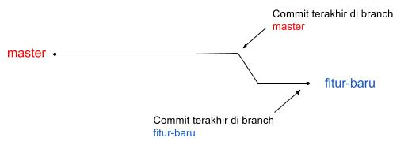

# Branching

Seperti source control pada umumnya, git memiliki fitur branching. Artinya perubahan versi source code dapat bercabang. Perubahan pada satu cabang tidak akan berpengaruh pada cabang lainnya sampai dilakukan _merge_ atau _rebase_.

## Canonical/Master Branch

* Master -> shared development branch, tidak boleh langsung push ke branch master
* Branch master selalu dijadikan sebagai reference (upstream)
* Branch master yang stable akan di-tag
* Tag production akan di deploy ke production

## Feature Branch

* Setiap developer ketika mendapat task untuk fitur baru harus membuat feature branch baru
* Perubahan yang terjadi pada feature branch ini sangat disarankan untuk fokus dan komplit untuk satu perubahan.
    * Prinsip *atomic*: satu fitur yang lengkap dan tidak mengganggu fitur lain
    * Bila diperlukan untuk mengubah modul lain yang berkaitan maka tidak apa-apa
    * Bila ditemukan bug/perubahan fitur di modul lain yang tidak ada hubungannya maka kerjakan di branch yang lain.
* Ketika feature branch akan di-merge ke master melalui proses merge request dan review.



*Ilustrasi: Branch master dan fitur*

## Merge

Proses _merge_ adalah proses menggabungkan versi source code dari satu cabang ke cabang yang lain, sehingga branch/cabang _target_ akan memiliki perubahan yang sama dengan branch _source_.

Sebagai _best practice_ selalu gunakan aturan berikut:

* `master` branch sebagai target branch
* `feature` branch sebagai source branch

Contoh (command line merge):

```sh
~$ git checkout master #master sebagai target branch yang kita checkout
~$ git merge feature #feature sebagai source branch yang bi merge ke master branch
```

Lebih lanjut untuk metode _merge_ dibahas di [sini](merge.md).

## Rebase

Poses _rebase_ adalah proses menggeser/mengupdate _base_ dari cabang/branch, sehingga branch yang sedang aktif akan terupdate dari branch source, tapi, kebalikan dari proses _merge_, bukan ditambah di depan branch target, tetapi digeser _base_ dari branch target. Sehingga di branch yang baru akan memuat histori perubahan yang sama dengan branch source, hanya saja ada tambahan di depannya.

Sebagai _best practice_, aturannya adalah:

* gunakan `master` branch sebagai source branch
* gunakan `feature` branch sebaga target branch

Contoh (command line rebase):

```sh
~$ git checkout feature #feature sebagai target branch yang kita checkout
~$ git pull --rebase origin master #pull rebase langsung dari remote master
```


Lebih lanjut untuk proses _rebase_ ada di [sini](development.md#fetch-rebase-master).
