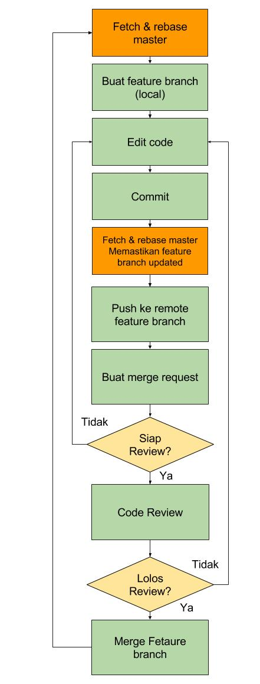

# Flow



*Keterangan: flow merge request dan pengerjaan fitur*

# Fetch & Rebase Master

* Pastikan repo lokal *clean*, tidak ada perubahan yang belum di commit. Cek status repo lokal dengan perintah:

```sh
~$ git status
```

* Cek dan pastikan ada di branch master dengan perintah

```sh
~$ git branch
```

* Kalau belum, pindah ke branch `master` menggunakan perintah:

```sh
~$ git checkout master
```

* Fetch dan rebase, gunakan perintah:

```sh
~$ git pull --rebase origin master
```

# Buat branch baru dan checkout di lokal

* Buat branch baru dengan menggunakan perintah

```sh
~$ git checkout -b nama-fitur
```

# Edit file & commit lokal

* Lakukan edit pada file yang dikerjakan, ketika sudah selesai satu fitur lakukan commit

```sh
~$ git add nama_file #menambahkan nama_file yang akan di commit
~$ git commit #commit di repo lokal
```

atau jika akan menambahkan semua file yang sudah di edit untuk di commit:

```sh
~$ git add . #menambahkan semua yang telah di edit untuk di commit
~$ git commit #commit di repo lokal
```


* Akan secara otomatis muncul text editor untuk menuliskan `COMMIT_EDITMSG`, yaitu keterangan commit, berikan keterangan singkat dan jelas mengenai apa yang diubah di dalam commit tersebut, misal deskripsi fitur atau deskripsi bug yang di-solve.

* Lakukan rebase lagi memastikan repo lokal terupdate.

```sh
~$ git pull --rebase origin master
```

# Bila terjadi konflik

Ketika proses rebase, ada kemungkinan terjadi conflict jika ada update di branch `master` di file yang sama dengan local feature branch.


Keterangan:

* File warna hijau adalah file yang sudah berhasil di 3-way merge secara otomatis oleh git, atau yang sudah di-resolve konfliknya secara manual dan dimasukkan ke commit stage dengan `git add nama_file`
* File warna merah adalah file yang di dalamnya masih ada konflik yang belum di-resolve.
* Status konflik bisa dicek dengan perintah `git status`.

Jika konflik terjadi, maka:

* Lakukan resolve conflict secara manual di lokal (untuk file yang di highlight warna merah).
* Gunakan perintah `git add nama-file-konflik` atau `nama-file-konflik` bisa diganti dengan `.` jika akan memasukkan semua file yang sudah di-resolve.
* Kemudian gunakan perintah `git rebase --continue` untuk melanjutkan proses rebase.
* Lakukan terus sampai konflik ter resolve semua,
    * Bisa dicek dengan perintah `git status` tidak lagi menunjukkan ada konflik.


# Push ke remote feature branch

* Setelah commit baru dibuat di lokal, maka saatnya untuk push ke remote feature branch.

```sh
~$ git push origin nama-fitur
```

* Push ke fitur branch boleh dilakukan kapan saja, misal:
    * untuk membuat backup data di server
    * ketika fitur sudah selesai dan akan dilakukan [merge request](mergerequest.md)
    * dengan catatan: tiap commit jelas melakukan apa, dan tercatat di `COMMIT_EDITMSG`, sehingga keterangannya dapat dibaca dengan perintah `git log`
