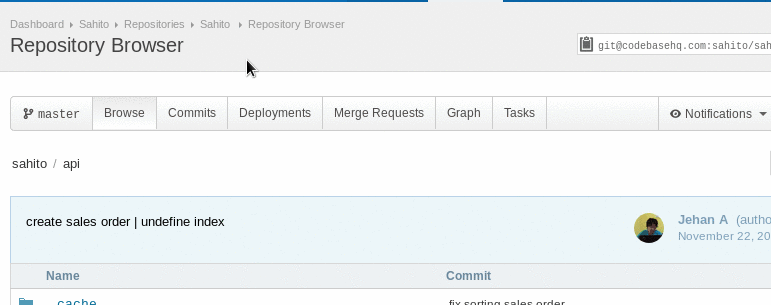

# Status

* WIP (work in progress)
    * Merge Request bisa dilakukan pada saat fitur sedang dikerjakan
    * Belum siap di merge
    * Untuk menandai merge request WIP, bisa dengan menambahkan keterangan `[WIP]` di judul merge request
* Ready to merge (in review)
    * Reviewer yang di assign akan memeriksa kode yang di submit
    * Selanjutnya akan di merge oleh reviewer/maintainer
    * Untuk menandai merge rjquest siap di merge, maka hapus keterangan `[WIP]` di judul merge request (jika ada).

# Membuat Merge Request

* Pastikan perubahan sudah di `commit` dan di `push` ke remote feature branch. Mengikuti langkah yang tertulis di [sini](development.md#push-ke-remote-feature-branch)
* Buka halaman web repository yang akan dibuat merge request
* kemudian pilih tab *Merge Request*

* Beri judul dan isi keterangan merge request
    * Bila merge request yang dibuat belum selesai (on progress) maka di judul diberi flag `[WIP]`
* Assign reviewer/maintainer
* Pastikan source branch menunjukkan branch fitur
* Pastikan target branch menunjukkan branch master
* Klik `Create Merge Request`

# Review dan revisi

* Reviewer dan developer (atau siapa saja yang memiliki akses ke repo) dapat memberikan komentar di file yang berubah.
* Apabila membutuhkan revisi, maka developer akan diberi informasi oleh reviewer untuk melakukan revisi.
* Selesai melakukan revisi, developer akan melakukan [commit](development.md#edit-file-commit-lokal) dan [push](development.md#push-ke-remote-feature-branch) ke feature branch lagi, seperti ditunjukkan di flow [ini](development.md#flow).
* Hapus status `[WIP]` dari judul merge request.
* Feature branch siap untuk di [merge](merge.md) ke master branch.

# Selesai

* Bila merge request sudah di merge oleh maintainer, maka developer dapat mengupdate branch master lokal, atau branch fitur lain yang sedang dikerjakan dengan metode [fetch-rebase](development.md#fetch-rebase-master)
* Untuk mengerjakan fitur lain, tidak perlu menunggu review selesai, cukup ganti branch ke branch lain yang akan dikerjakan.

